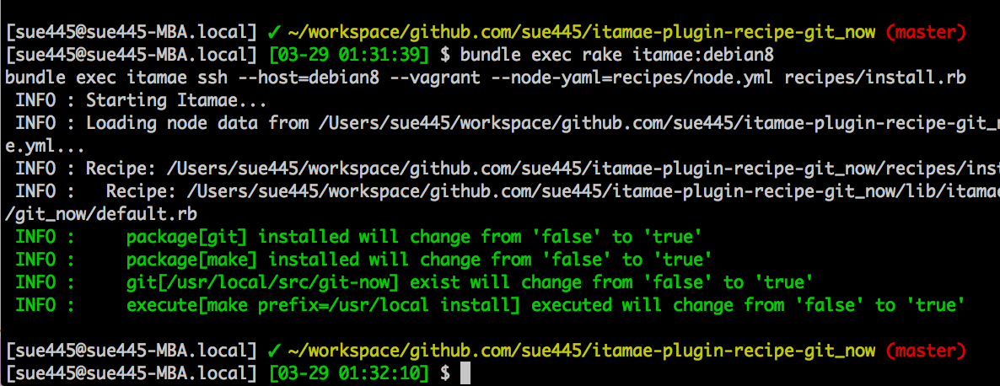
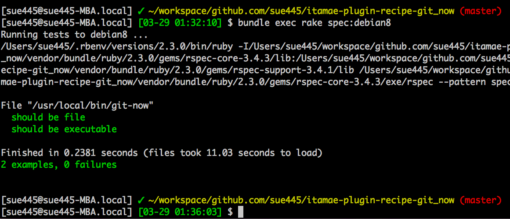

# itamaeプラグインを<br>本気でCIした #omotesandorb
sue445

2016/04/07 表参道.rb #10

---
## 自己紹介 [](https://twitter.com/sue445)

* [sue445](https://twitter.com/sue445)
* Ruby歴：5年くらい
* golang歴：半年くらい
* Go歴：33年 -> 34年（34歳） (NEW!)
  * 4/7が誕生日 :birthday::birthday:
  * wishlist http://www.amazon.co.jp/registry/wishlist/3HH1FL88AQAG8/

---
## 自己紹介
* [株式会社ドリコム](http://www.drecom.co.jp/) 所属
* サーバサイドを浅く広く
  * 最近のお仕事はプロビジョニング周り
  * itamae, Serverspec, vagrant（ギリギリRuby）
* TDDおじさん
* プリキュアおじさん

---
## 代表作
https://rubygems.org/profiles/sue445


---
## 代表作
https://github.com/sue445


---
## 近況：最近送ったPullRequest
* vagrant-awsプラグイン（のスポットインスタンス対応版のフォーク）
  * https://github.com/KariusDx/vagrant-aws/pull/2
  * スポットインスタンス作成時にIAMロールが適用されなかったので適用されるようにした
* vagrant-cloudstackプラグイン（1つ目）
  * https://github.com/schubergphilis/vagrant-cloudstack/pull/148
  * 複数のnetwork idを渡せるようにした
* vagrant-cloudstackプラグイン（2つ目）
  * https://github.com/schubergphilis/vagrant-cloudstack/pull/149
  * 複数NICがある場合にeth0以外でsshしたかった

---
## 今期の嫁：まだ未定


http://www.toei-anim.co.jp/tv/precure/

---
## 本妻：キュアピース


---
## 今期のプリキュアはRubyがテーマ
<iframe width="560" height="315" src="https://www.youtube.com/embed/pFHtPqx-lBU" frameborder="0" allowfullscreen></iframe>

https://www.youtube.com/watch?v=pFHtPqx-lBU

---
## Agenda
* itamaeについて
* itamaeプラグインについて
* itamaeプラグインのテスト事情
* itamaeプラグインをテストする
* ビルドの並列実行
* 小ネタ

---
## 三行まとめ
* Vagrant
* Wercker
* DigitalOcean

---
## itamaeについて
* https://github.com/itamae-kitchen/itamae
* Ruby製のプロビジョニングツール(ChefとかAnsibleみたいなやつ)

---
## itamaeプラグインについて
レシピ（ミドルウェアのインストール手順など）をgemにしてRubygems.orgで公開することができる

### Gemfile

```ruby
gem "itamae-plugin-recipe-git_now"
```

### recipe.rb

```ruby
include_recipe "git_now"
```

[git-now](https://github.com/iwata/git-now) がインストールされる

---
## sue445製itamaeプラグイン
* [https://github.com/sue445/itamae-plugin-resource-encrypted\_remote\_file](https://github.com/sue445/itamae-plugin-resource-encrypted_remote_file)
* [https://github.com/sue445/itamae-plugin-recipe-tmux](https://github.com/sue445/itamae-plugin-recipe-tmux)
* [https://github.com/sue445/itamae-plugin-recipe-tig](https://github.com/sue445/itamae-plugin-recipe-tig)
* [https://github.com/sue445/itamae-plugin-recipe-git\_now](https://github.com/sue445/itamae-plugin-recipe-git_now)
* [https://github.com/sue445/itamae-plugin-recipe-omori\_gohan](https://github.com/sue445/itamae-plugin-recipe-omori_gohan)

---
## itamaeプラグインのテスト事情
https://rubygems.org/search?utf8=%E2%9C%93&query=itamae-plugin

* 47個中、テストを書いてるgemは18個
  * `bundle gem` 直後の `expect(Itamae::Plugin::Recipe::Hoge::VERSION).not_to be nil` しかないやつはノーカン
* CIしてるgemは5個（全部自分のやつｗ）
  * `bundle gem` 直後の .travis.yml しかないやつはノーカン
* itamaeプラグインのCIの知見を広めたいのが今回の主旨

---
## CIされてることのメリット
* 複数OSテストしたい時に動作確認が楽（開発者視点）
* リポジトリのトップにTravis CIとかのバッジが貼ってあれば安心感がある（利用者視点）
  * 常にビルドされているという安心感
  * PR送った時にビルドの結果が出る安心感

 

---
## itamaeプラグインをテストする手順
1. ローカルでVagrant + VirtualBox環境構築
2. 自分自身を適用するレシピと、それに対するテストを書く
3. VirtualBox内でitamaeのレシピ＆Serverspec実行
4. CIでレシピ＆Serverspec実行

LTだと尺が足らないので駆け足でいきます。（詳しい手順は後日ブログに書きます）

---
### 1. ローカルでVagrant + VirtualBox環境構築
* https://www.vagrantup.com/downloads.html
* https://www.virtualbox.org/wiki/Downloads

からバイナリをインストール

---
### 2. 自分自身を適用するレシピと、それに対するテストを書く
[install.rb](https://github.com/sue445/itamae-plugin-recipe-git_now/blob/v0.1.1/recipes/install.rb)

```ruby
include_recipe "git_now"
```

[git\_now\_spec.rb](https://github.com/sue445/itamae-plugin-recipe-git_now/blob/v0.1.1/spec/git_now_spec.rb)

```ruby
describe file("#{node[:git_now][:prefix]}/bin/git-now") do
  it { should be_file }
  it { should be_executable }
end
```

[Serrverspec](http://serverspec.org/) だとインフラの構成をrspecでテストすることができる

---
### 3. VirtualBox内でitamaeのレシピ＆Serverspec実行
itamae実行



---
### 3. VirtualBox内でitamaeのレシピ＆Serverspec実行
Serverspec実行



---
### 4. CIでレシピ＆Serverspec実行
* DigitalOcean
* Wercker

を使う方法について紹介

---
#### [DigitalOcean](https://www.digitalocean.com/)
* 海外の格安VPS
* 最低プランなら1時間で$0.007から使える
  * 1ドル113円なら0.79円
  * $10のクーポンコードもあるので1428時間は無料で使える
  * https://m.do.co/c/7978f6d6167e (ﾁﾗﾁﾗｯ
* 全部SSDなので速い
* ビルドする時だけインスタンスを立ち上げれば費用を抑えることができる

---
#### [Wercker](http://wercker.com/)
* CIサービス([Travis CI](https://travis-ci.org/)や[Circle CI](https://circleci.com/)的なやつ)
* 「ワーカー」と読むらしい
* box（実行環境）やstep（実行コマンド）がプラグインとして提供されているのが特徴
  * 自分で作ったプラグインを [Registory](https://app.wercker.com/#explore) で自由に公開できる

---
https://github.com/sue445/wercker-box-rvm-vagrant-digitalocean

* [wercker-box-rvm-vagrant-aws](https://github.com/masutaka/wercker-box-rvm-vagrant-aws) をforkしてrvmとvagrantとvagrant-digitaloceanプラグインをインストール済のboxを作った

---
[wercker.yml](https://github.com/sue445/itamae-plugin-recipe-git_now/blob/v0.1.1/wercker.yml#L6)

```yaml
box: sue445/rvm-vagrant-digitalocean@1.0.0
```

---
### CI設定
[wercker.yml](https://github.com/sue445/itamae-plugin-recipe-git_now/blob/575ef249811ceaeba5d80ecde830c30cea46395c/wercker.yml#L63-L69)

```yaml
build:
    steps:
        - script:
            name: test centos70
            code: ./ci/build.sh centos70

        - script:
            name: test debian8
            code: ./ci/build.sh debian8
```

[build.sh](https://github.com/sue445/itamae-plugin-recipe-git_now/blob/575ef249811ceaeba5d80ecde830c30cea46395c/ci/build.sh)

```sh
#!/bin/bash -xe

readonly HOST=$1

vagrant up $HOST --provider=digital_ocean
bundle exec rake itamae:$HOST
bundle exec rake spec:$HOST
vagrant destroy -f $HOST
```

---
## ビルドの並列実行
直列実行だと遅い（2つ合わせて5分くらいかかる）ので並列実行できるようにした

---
### [Paraduct](https://github.com/sue445/paraduct)
* Paraduct (parallel + parameterize + product)
* .travis.ymlみたいな感じにいい感じにマトリックステストをするためのgem
* 2年前に作ったgemなんだけどいろいろ書き直した
  * v0.0.3 -> v1.0.0 :muscle:

---
[.paraduct.yml](https://github.com/sue445/itamae-plugin-recipe-git_now/blob/89efca00a3c9b2f66e69fc95c48c02b55bed4014/.paraduct.yml)

```yaml
script: |-
  ./ci/build.sh ${HOST}
after_script: |-
  vagrant destroy -f $HOST
variables:
  HOST:
    - debian8
    - centos70
max_threads: 4
```

* この例だと `./ci/build.sh debian8` と `./ci/build.sh centos70` が並列に実行される
* `after_script` はビルドが失敗時しても必ず実行されるので確実にVMをdestroyしてくれる

---
capistranoみたいにホストごとに色がつくのが特徴


https://app.wercker.com/#buildstep/56f46fa951d1ad950a01ad71

---
## 小ネタ
* DigitalOceanのregionは当たり外れがある（気がする）
  * nyc1だとたまにVM起動後にsshが通らなくて固まることがあるけど、nyc3に変えたら起こらなくなった
  * ハマったら他のregionに変えてみるとよさげ
* 不慮の事故でVMが残り続けるのを防ぐために古いVMを削除するスクリプトをheroku schedulerで動かしてる
  * [https://github.com/itamae-kitchen/itamae/blob/master/ci/destroy\_old\_droplets.rb](https://github.com/itamae-kitchen/itamae/blob/master/ci/destroy_old_droplets.rb)

---
## 参考文献
* オライリーのServerspec本
  * http://www.oreilly.co.jp/books/9784873117096/
* itamaeやServerspecの `wercker.yml` や `Vagrantfile` を熟読した
  * https://github.com/itamae-kitchen/itamae
  * https://github.com/serverspec/serverspec-integration-test

---

## 重要なことなので最後にもう一度
http://www.amazon.co.jp/registry/wishlist/3HH1FL88AQAG8/
